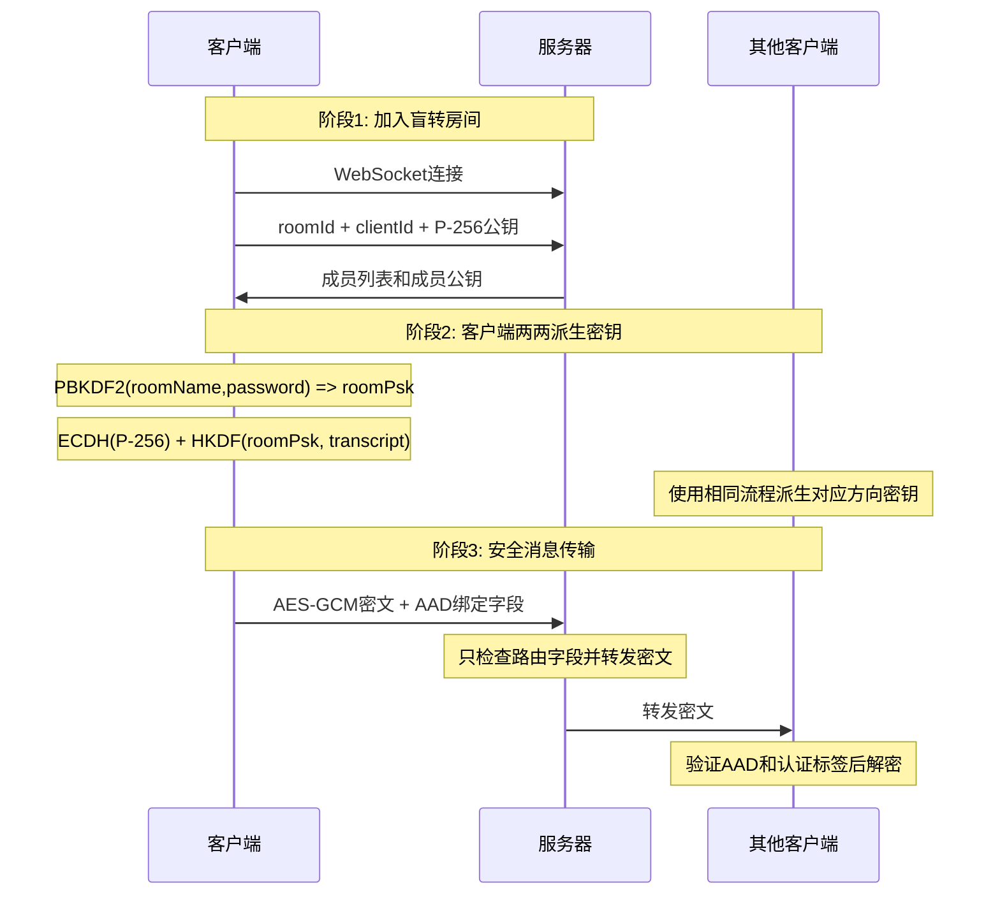

# NodeCrypt

🌐 **[English README](README_EN.md)**

## 🚀 部署说明

### 一键部署到 Cloudflare Workers

点击下方按钮即可一键部署到 Cloudflare Workers：

[](https://deploy.workers.cloudflare.com/?url=https://github.com/shuaiplus/NodeCrypt)

- 构建命令：npm run build
- 部署命令：npm run deploy
- 运行要求：Node.js 22+

### Docker 自托管

```bash
docker run -d --name nodecrypt -p 8088:8088 ghcr.io/shuaiplus/nodecrypt
```

访问 `http://localhost:8088`

## 📝 项目简介

NodeCrypt 是一个真正的端到端加密聊天系统，实现完全的零知识架构。整个系统设计确保服务器、网络中间人、甚至系统管理员都无法获取任何明文消息内容。所有加密和解密操作都在客户端本地进行，服务器仅作为加密数据的盲中继。

### 系统架构
- **前端**：ES6+ 模块化 JavaScript，无框架依赖
- **后端**：Cloudflare Workers + Durable Objects
- **通信**：WebSocket 实时双向通信
- **构建**：Vite 现代化构建工具

## 🔐 零知识架构设计

### 核心原则
- **服务器盲转**：服务器永远无法解密消息内容，仅负责加密数据中转
- **无数据库存储**：系统不使用任何持久化存储，所有数据仅在内存中临时存在
- **端到端加密**：消息从发送方到接收方全程加密，中间任何环节都无法解密
- **会话级临时密钥**：每次连接生成新的 ECDH 会话密钥，新加入用户无法读取历史消息
- **匿名通信**：用户无需注册真实身份，支持临时匿名聊天
- **多样体验**：和批量发送图片和文件，可选择主题和语言。

### 隐私保护机制

- **实时成员提醒**：房间在线列表完全透明，内任何人加入或离开都会实时通知所有成员，
- **无历史消息**：新加入的用户无法看到任何历史聊天记录
- **私聊加密**：点击用户头像可发起端到端加密的私密对话，房间内其他成员完全无法看到私聊内容
- **安全分享**：分享邀请使用 URL fragment，不会把房间名或密码发送到服务器日志
- **成员安全码**：成员列表显示临时公钥指纹，可通过其他渠道核对当前会话对端

### 房间密码机制

房间密码作为**密钥派生因子**参与端到端加密：客户端先使用 PBKDF2-HMAC-SHA-256 从房间名和密码派生房间密钥，再通过 HKDF 与每个成员的 ECDH 共享秘密组合，生成用途隔离的消息密钥。

- **密码错误隔离**：不同密码的房间无法解密彼此的消息
- **服务器盲区**：服务器永远无法获知房间密码

### V2 安全体系

#### 第一层：服务端盲转
- 服务端只按 `roomId` 管理 WebSocket 成员、广播成员公钥、转发密文
- 服务端不接收房间密码，不生成会话密钥，也不解密任何聊天或文件内容

#### 第二层：ECDH-P256 + HKDF 密钥协商
- 每个客户端每次连接生成独立的 P-256 ECDH 会话密钥对
- 客户端两两计算共享秘密，并通过 HKDF 绑定房间密钥、成员 ID、公钥 transcript
- 每个发送方向都有独立的 AEAD key 和 nonce 序列

#### 第三层：AES-256-GCM 认证加密
- 文本、图片、文件元数据和文件分卷都通过客户端间的 AES-GCM 加密
- 每条消息带有 AAD，绑定协议版本、房间、发送方、接收方、消息类型和序号
- 任意密文或路由字段被篡改都会导致认证失败并被丢弃

## 🔄 完整加密流程详解




## 🛠️ 技术实现

- **Web Cryptography API**：浏览器原生实现 PBKDF2、HKDF、P-256 ECDH、AES-GCM 和 SHA-256

## 🔬 安全验证

### 加密过程验证
用户可通过浏览器开发者工具观察完整的加密解密过程，验证消息在传输过程中确实处于加密状态。

### 网络流量分析
使用网络抓包工具可以验证所有 WebSocket 传输的数据都是不可读的加密内容。

### 代码安全审计
所有加密相关代码完全开源，使用标准密码学算法，欢迎安全研究者进行独立审计。

## ⚠️ 安全建议

- **使用强房间密码**：房间密码直接影响端到端加密强度，建议使用复杂密码
- **密码保密性**：房间密码一旦泄露，该房间所有通信内容都可能被解密
- **核对成员安全码**：如需确认对方身份，请通过其他可信渠道核对成员列表中的安全码
- **使用最新版本的现代浏览器**：确保密码学API的安全性和性能

## 🤝 安全贡献

欢迎安全研究者报告漏洞和进行安全审计。严重安全问题将在24小时内修复。

## 📄 开源协议

本项目采用 ISC 开源协议。

## ⚠️ 免责声明

本项目仅供学习和技术研究使用，不得用于任何违法犯罪活动。使用者应遵守所在国家和地区的相关法律法规。项目作者不承担因使用本软件而产生的任何法律责任。请在合法合规的前提下使用本项目。

---
## Star History

[](https://www.star-history.com/#shuaiplus/NodeCrypt&Timeline)

**NodeCrypt** - 真正的端到端加密通信 🔐

*"在数字时代，加密是保护隐私的最后一道防线"*
